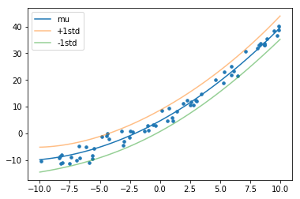
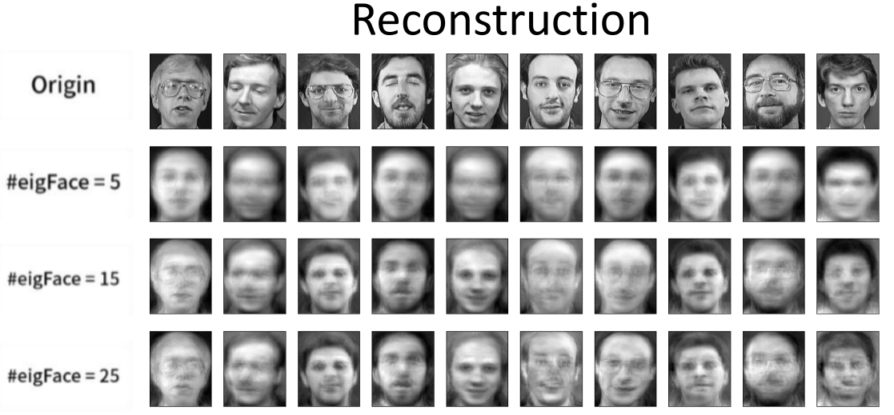
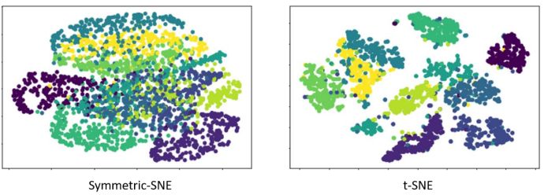

Table of Contents
=================
  * [Linear-Regression](#Linear-Regression)
  * [Naive-Bayes](#Naive-Bayes)
  * [Predictive-Distribution](#Predictive-Distribution)
  * [Expectation–Maximization](#Expectation–Maximization)
  * [Support-Vector-Machine](#Support-Vector-Machine)
  * [K-Means_Spectral-clustering](#K-Means_Spectral-clustering)
  * [Eigen-Face](#Eigen-Face)
  * [T-SNE](#T-SNE)
  
## Linear-Regression
Implement linear regression using Least Square error with regularization and Newton' method for optimization.

## Naive-Bayes
Implement MINIST hand written digit recognition using naive-bayes classifier (discrete and continuous) 

 
 

## Predictive-Distribution
Implement Posterior predictive distribution using gaussian.

 
 

## Expectation–Maximization
Implement EM

 
 

## Support-Vector-Machine
Experiment with SVM (using libsvm) for different kernel, including linear kernel, polynomial kernl and RBF kernel.

 
 

## K-Means_Spectral-clustering
Implement K-Means and Spectral-clustering.

 
 

## Eigen-Face
Implement Eigen-Face.

 
 

## t-SNE
Implement t-SNE.

 
 