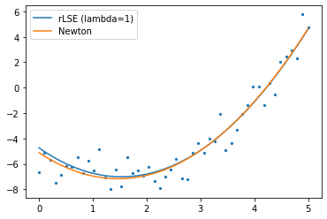
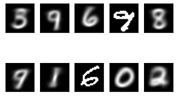
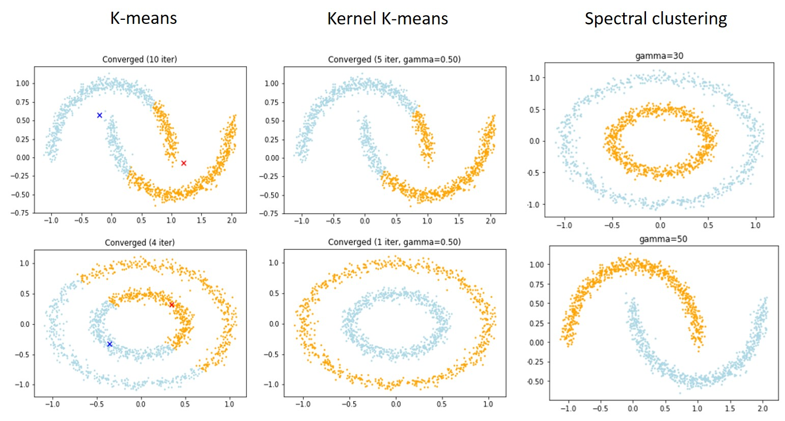

Table of Contents
=================
  * [Linear-Regression](#Linear-Regression)
  * [Naive-Bayes](#Naive-Bayes)
  * [Predictive-Distribution](#Predictive-Distribution)
  * [Expectation–Maximization](#Expectation–Maximization)
  * [Support-Vector-Machine](#Support-Vector-Machine)
  * [K-Means_Spectral-clustering](#K-Means_Spectral-clustering)
  * [Eigen-Face](#Eigen-Face)
  * [T-SNE](#T-SNE)
  
## Linear-Regression
Implement linear regression using **Least Square error with regularization (rLSE)** and **Newton' method** for optimization.

 
 

## Naive-Bayes
Implement MINIST hand written digit recognition using naive-bayes classifier (discrete and continuous) 

 
 

## Predictive-Distribution
Implement **gaussian posterior predictive distribution**.

 
 

## Expectation–Maximization
Implement Expectation–Maximization (EM).

 
 

## Support-Vector-Machine
Experiment with SVM (using libsvm) for different kernel, including **linear kernel**, **polynomial kernl** and **RBF kernel**.

|   | Linear  | Polynomial   | RBF   |
|:-------------:|:-------------:|:-------------:|:-------------:|
| Accuracy  |  95.00%  | 97.68%  | 98.08%  |

## K-Means_Spectral-clustering
Implement **K-Means** and **Spectral-clustering**.

 
 

## Eigen-Face
Implement **Eigen-Face**.

 
 

## t-SNE
Implement the visualization of **embedding** using **symmetric-SNE** and **t-SNE**.

 
 